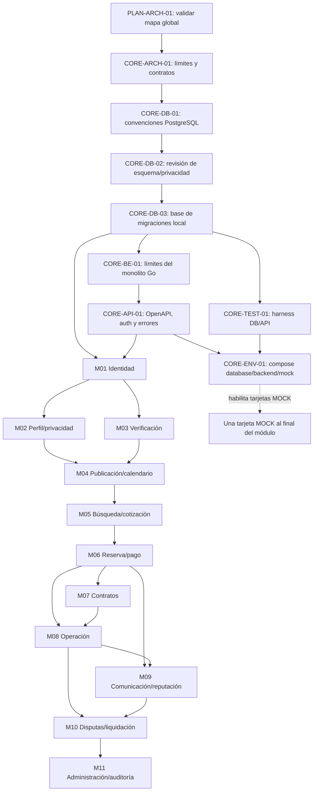

# Grafo de dependencias y Kanban

## Estado del tablero

Hermes Kanban local `espacigo` contiene 102 tarjetas y 184 dependencias. Lectura del 2026-10-01: 11 `done`, 1 `blocked`, 90 `todo`, 0 `review`/`ready`/`running`. CORE-ARCH-01, CORE-DB-01, CORE-DB-02 y CORE-DB-03 están `done` con PRs #2–#5 fusionados. DB02-09 mantiene abiertas las decisiones de RQF-213, -217 y -218; cerrar CORE-DB-02 no las resuelve. CORE-BE-01 ya figura `done` en Kanban por una ejecución local previa, pero su línea fuente queda en `review` mientras su PR de esta entrega espera revisión. Tras publicar se intentará `hermes kanban request-review t_39a64c51` (transición soportada); si el estado terminal impide el cambio, se conservará y documentará la divergencia sin tocar la base. El tablero local no es un servicio Kanban externo.

## Grafo global

Cada módulo tiene su propio subgrafo en `backlog.md`: diseño de módulo → modelado DB → migración → dominio/repositorio → casos de uso → API → pruebas → mock. M04 y M06 añaden cortes funcionales por tamaño. El orden global permite paralelizar M02 y M03 después de identidad; contratos y operaciones se separan tras reservas, con dependencias de sus estados.

## Secuencia recomendada

1. `PLAN-ARCH-01` está cerrado con ratificación MAP-01–MAP-10 y PR #1. `CORE-ARCH-01` está cerrado tras aprobación y fusión de PR #2.
2. CORE-DB-01, CORE-DB-02 y CORE-DB-03 están cerradas por PRs #4, #5 y #3 fusionados. DB02-09 continúa abierto: cualquier DDL/implementación que dependa de preferencia de uso, historial de claves o evento de notificación necesita decisión y ticket trazable antes de ejecutarse.
3. CORE-BE-01 es la siguiente tarjeta habilitada: CORE-ARCH-01 (#2) y CORE-DB-03 (#3) están fusionadas. Su especificación está en revisión por PR separado; CORE-API-01 y las sucesoras dependientes esperan esa revisión. AUTH-ARCH-01 también espera CORE-API-01, por lo que no se inicia AUTH-DB-01/02.
4. Desarrollar M02 y M03 en paralelo si el equipo lo permite; M04 espera ambos.
5. M04 → M05 → M06, porque catálogo, tarifa, disponibilidad y cotización son prerrequisitos del flujo transaccional.
6. M07 y M08 parten desde M06; M08 además requiere contrato firmado según reglas aplicables.
7. M09 requiere reserva y operación; M10 requiere reclamo/evidencia y cierre operativo.
8. M11 reportes operacionales al final; la infraestructura lógica mínima de auditoría/outbox ya se trabaja en fundación y se extiende en cada módulo.

## Conteo sincronizado al 2026-10-01

Conteo verificado: Kanban 102 tarjetas/184 dependencias, 11 módulos funcionales y un bloque transversal; 11 `done`, 1 `blocked`, 90 `todo`, 0 `ready`/`review`/`running`. Tras completar DB-02 y publicar BE-01 a revisión, el registro fuente suma 5 `done`, 1 `review`, 96 `todo`. BE-01 figura `done` en el tablero por el run local anterior; se intentará moverlo a `review` solo mediante `request-review`. No se cambia almacenamiento directamente ni se avanza a sucesores antes de cumplir sus gates.

El estado representa el avance y las dependencias del tablero local. No se asignaron responsables humanos ni fechas sin acuerdo del equipo.
