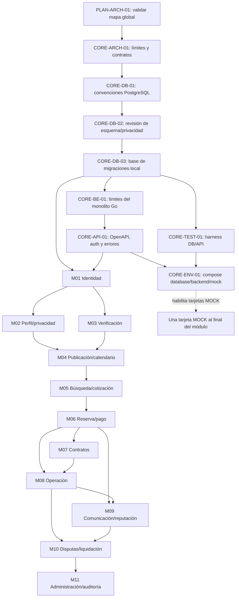

# Grafo de dependencias y Kanban

## Estado del tablero

Hermes Kanban local `espacigo` contiene 102 tarjetas y 184 dependencias. Lectura del 2026-10-02: 11 `done`, 1 `blocked`, 90 `todo`, 0 `review`/`ready`/`running`; el registro fuente suma 6 `done`, 1 `review` y 95 `todo`. PRs #2–#6 están fusionados; CORE-DB-01/02/03 y CORE-BE-01 están `done`. DB02-09 mantiene abiertas las decisiones de RQF-213, -217 y -218; completar CORE-DB-02 no las resuelve. CORE-API-01 es la siguiente tarjeta fundacional habilitada por el grafo, pero su estado fuente es `review` con PR #7 mientras Kanban conserva `done` por un run local anterior que no ejecutó un parser OpenAPI dedicado. Se registró PR #7 en el comentario admitido del CLI; la tarjeta continúa `done` en Kanban, sin transición desde ese estado ni edición directa de su base. No hay implementación DB/Backend inmediatamente habilitada antes de cerrar esta base API; no ejecutar DDL dependiente de DB02-09.

## Grafo global

Cada módulo tiene su propio subgrafo en `backlog.md`: diseño de módulo → modelado DB → migración → dominio/repositorio → casos de uso → API → pruebas → mock. M04 y M06 añaden cortes funcionales por tamaño. El orden global permite paralelizar M02 y M03 después de identidad; contratos y operaciones se separan tras reservas, con dependencias de sus estados.

## Secuencia recomendada

1. `PLAN-ARCH-01` está cerrado con ratificación MAP-01–MAP-10 y PR #1. `CORE-ARCH-01` está cerrado tras aprobación y fusión de PR #2.
2. CORE-DB-01, CORE-DB-02 y CORE-DB-03 están cerradas por PRs #4, #5 y #3 fusionados. DB02-09 continúa abierto: cualquier DDL/implementación que dependa de preferencia de uso, historial de claves o evento de notificación necesita decisión y ticket trazable antes de ejecutarse.
3. CORE-BE-01 quedó `done` por PR #6 aprobado y fusionado el 2026-10-02. Kanban ya mostraba `done`; el merge quedó registrado mediante comentario admitido, sin transición ni edición directa.
4. CORE-API-01 es el siguiente prerrequisito habilitado: depende de CORE-BE-01. Su contrato común está en el PR #7 para revisión; el tablero conserva `done` de un run local anterior y no se cambia desde ese estado. No hay una implementación DB/Backend inmediatamente habilitada antes de cerrar este prerrequisito; AUTH-ARCH-01/CORE-TEST-01 y sus sucesoras esperan la aceptación de CORE-API-01.
5. AUTH-ARCH-01 precede AUTH-DB-01 y debe mantener explícitas las decisiones DB02-09 (RQF-213/-217/-218); no iniciar DDL dependiente hasta obtenerlas o crear tickets trazables.
6. Desarrollar M02 y M03 en paralelo si el equipo lo permite; M04 espera ambos.
7. M04 → M05 → M06, porque catálogo, tarifa, disponibilidad y cotización son prerrequisitos del flujo transaccional.
8. M07 y M08 parten desde M06; M08 además requiere contrato firmado según reglas aplicables. M09 requiere reserva y operación; M10 requiere reclamo/evidencia y cierre operativo.
9. M11 reportes operacionales al final; la infraestructura lógica mínima de auditoría/outbox ya se trabaja en fundación y se extiende en cada módulo.

## Conteo sincronizado al 2026-10-02

Conteo verificado: Kanban 102 tarjetas/184 dependencias, 11 módulos funcionales y un bloque transversal; 11 `done`, 1 `blocked`, 90 `todo`, 0 `ready`/`review`/`running`. El registro fuente suma 6 `done`, 1 `review`, 95 `todo`: #6 cierra CORE-BE-01 y PR #7 deja CORE-API-01 en revisión. La diferencia de estado CORE-API-01 permanece documentada porque Kanban la conserva `done`; el comentario se añadió por CLI admitido y no se cambió su estado. No se edita el almacenamiento del tablero ni se desbloquean sucesores sin cumplir sus gates.

El estado representa el avance y las dependencias del tablero local. No se asignaron responsables humanos ni fechas sin acuerdo del equipo.
