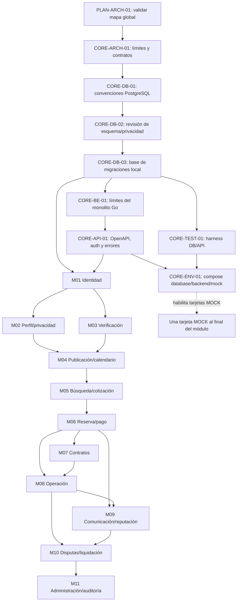

# Grafo de dependencias y Kanban

## Estado del tablero

Hermes Kanban local `espacigo` contiene las 102 tarjetas del registro fuente y 184 dependencias. Al 2026-10-01, `PLAN-ARCH-01` está `done` con PR #1 como evidencia; `CORE-ARCH-01` está `review`; sus sucesores siguen `todo`. `backlog.md` refleja esos estados. El tablero local no es un servicio Kanban externo.

## Grafo global

Cada módulo tiene su propio subgrafo en `backlog.md`: diseño de módulo → modelado DB → migración → dominio/repositorio → casos de uso → API → pruebas → mock. M04 y M06 añaden cortes funcionales por tamaño. El orden global permite paralelizar M02 y M03 después de identidad; contratos y operaciones se separan tras reservas, con dependencias de sus estados.

## Secuencia recomendada

1. `PLAN-ARCH-01` está cerrado con ratificación MAP-01–MAP-10 y evidencia PR #1. `CORE-ARCH-01` está en revisión; no se promueven sucesores hasta aprobarla.
2. Después de la revisión, continuar con las tarjetas de fundación según el grafo; no iniciar DDL antes de completar y revisar la fundación acordada.
3. Implementar M01 con DB antes de dominio/API; validarlo en mock.
4. Desarrollar M02 y M03 en paralelo si el equipo lo permite; M04 espera ambos.
5. M04 → M05 → M06, porque catálogo, tarifa, disponibilidad y cotización son prerrequisitos del flujo transaccional.
6. M07 y M08 parten desde M06; M08 además requiere contrato firmado según reglas aplicables.
7. M09 requiere reserva y operación; M10 requiere reclamo/evidencia y cierre operativo.
8. M11 reportes operacionales al final; la infraestructura lógica mínima de auditoría/outbox ya se trabaja en fundación y se extiende en cada módulo.

## Conteo sincronizado al 2026-10-01

Conteo recalculado contra Hermes Kanban: 102 tarjetas, 184 dependencias, 11 módulos funcionales más 1 bloque transversal. Distribución: 1 `done`, 1 `review`, 100 `todo`, 0 `ready` y 0 `running`. Los sucesores de `CORE-ARCH-01` permanecen pendientes de su revisión; no se habilita otra tarjeta. La tabla de distribución por módulo está al inicio de `backlog.md`.

El estado representa el avance y las dependencias del tablero local. No se asignaron responsables humanos ni fechas sin acuerdo del equipo.
