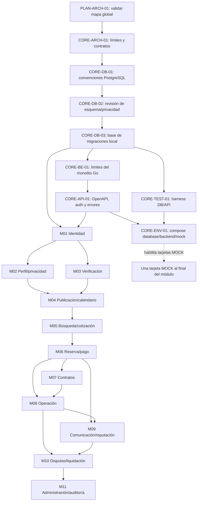

# Grafo de dependencias y Kanban

## Estado del tablero

Hermes Kanban local `espacigo` contiene 102 tarjetas y 184 dependencias. Lectura del 2026-10-02: 11 `done`, 1 `blocked`, 90 `todo`, 0 `review`/`ready`/`running`; el registro fuente suma 7 `done`, 1 `review`, 1 `blocked` y 93 `todo`. PR #7 está fusionado (CORE-API-01, SHA `100370e2e24dbf81a29d62014d6731081d4ff060`); CORE-DB-01/02/03 y CORE-BE-01 también están `done`. CORE-TEST-01 cumple dependencias CORE-DB-03 y CORE-API-01 y se presenta en el [PR #8](https://github.com/HernanEspinozaDev/espaciGo/pull/8); CORE-ENV-01 espera su cierre. AUTH-ARCH-01 tiene prerrequisitos satisfechos, pero su artefacto sigue solo en un worktree local y no se considera aceptado en la fuente; AUTH-DB-01 también carece de PR fusionado. AUTH-DB-02 es la próxima candidata DB del camino M01, pero está `blocked`: canonicalización/casefold de correo, semántica de expiración por inactividad y TTL/límites de tokens siguen sin decisión; tampoco hay una base PostgreSQL desechable con permisos DDL para validar la migración. DB02-09 mantiene abiertas las decisiones RQF-213/-217/-218; no se implementa DDL que dependa de ellas. Kanban conserva algunos estados `done` de ejecuciones locales previas; se documenta la discrepancia sin editar su base.

## Grafo global

Cada módulo tiene su propio subgrafo en `backlog.md`: diseño de módulo → modelado DB → migración → dominio/repositorio → casos de uso → API → pruebas → mock. M04 y M06 añaden cortes funcionales por tamaño. El orden global permite paralelizar M02 y M03 después de identidad; contratos y operaciones se separan tras reservas, con dependencias de sus estados.

## Secuencia recomendada

1. `PLAN-ARCH-01` está cerrado con ratificación MAP-01–MAP-10 y PR #1. `CORE-ARCH-01` está cerrado tras aprobación y fusión de PR #2.
2. CORE-DB-01, CORE-DB-02 y CORE-DB-03 están cerradas por PRs #4, #5 y #3 fusionados. DB02-09 continúa abierto: cualquier DDL/implementación que dependa de preferencia de uso, historial de claves o evento de notificación necesita decisión y ticket trazable antes de ejecutarse.
3. CORE-BE-01 quedó `done` por PR #6 aprobado y fusionado el 2026-10-02. Kanban ya mostraba `done`; el merge quedó registrado mediante comentario admitido, sin transición ni edición directa.
4. CORE-API-01 depende de CORE-BE-01 y quedó `done` al fusionarse PR #7 el 2026-10-02 (SHA `100370e2e24dbf81a29d62014d6731081d4ff060`). CORE-TEST-01 también tiene dependencias satisfechas (CORE-DB-03 y CORE-API-01); esta rama publica su contrato de harness en revisión. CORE-ENV-01 espera el cierre de CORE-TEST-01.
5. AUTH-ARCH-01 también es elegible por CORE-API-01 y CORE-DB-02, pero el resultado local en `t_84cb0ac5` no está en un PR/main y contiene decisiones que requieren revisión; se conserva `todo` en el registro fuente. AUTH-DB-01 también permanece `todo` hasta que su artefacto local sea publicado y aceptado.
6. AUTH-DB-02 es el próximo candidato de implementación DB por orden de M01, pero no está habilitado: Kanban lo marca `blocked`, no se pudo probar DDL en una instancia desechable y siguen pendientes decisiones sobre canonicalización de correo, semántica de expiración inactiva y TTL/límites de tokens. DB02-09 continúa abierto aparte; no crear DDL que lo presuponga. AUTH-BE-01 permanece dependiente de la migración aceptada.
7. Desarrollar M02 y M03 en paralelo si el equipo lo permite; M04 espera ambos.
8. M04 → M05 → M06, porque catálogo, tarifa, disponibilidad y cotización son prerrequisitos del flujo transaccional.
9. M07 y M08 parten desde M06; M08 además requiere contrato firmado según reglas aplicables. M09 requiere reserva y operación; M10 requiere reclamo/evidencia y cierre operativo.
10. M11 reportes operacionales al final; la infraestructura lógica mínima de auditoría/outbox ya se trabaja en fundación y se extiende en cada módulo.

## Conteo sincronizado al 2026-10-02

Conteo verificado: Kanban 102 tarjetas/184 dependencias, 11 módulos funcionales y un bloque transversal; 11 `done`, 1 `blocked`, 90 `todo`, 0 `ready`/`review`/`running`. El registro fuente suma 7 `done`, 1 `review`, 1 `blocked`, 93 `todo`: CORE-API-01 se cerró por PR #7; CORE-TEST-01 está en review. Kanban conserva `done` para CORE-TEST-01 por su run local previo, igual que para CORE-ENV-01/AUTH-ARCH-01/AUTH-DB-01; los tres últimos artefactos no tienen PR fusionado y permanecen `todo` en fuente. AUTH-DB-02 figura `blocked` tanto en Kanban como en fuente. No se editó almacenamiento del tablero ni se desbloquearon sucesores sin satisfacer sus gates.

El estado representa el avance y las dependencias del tablero local. No se asignaron responsables humanos ni fechas sin acuerdo del equipo.
