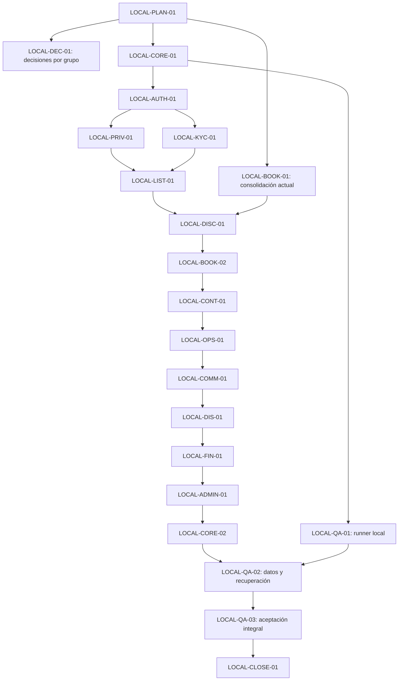

# Plan de cierre del desarrollo local del backend

Fecha inicial: 2026-10-07. Línea base conciliada en esta entrega: `main` `1beae923d1af4891e4c7bd1ce62b7952a260cdc3` (merge #199, 2026-10-08).

Actualización funcional (2026-10-09): tras los merges #211/#213, `main` integra publicación local y su conexión a búsqueda/detalle/cotización. #212 quedó aceptada como slice sin cerrar M04/M05. LOCAL-BOOK-02 (#214, hija de #73 y relacionada con #75/#77) consolida reserva, pago fake y decisión sobre una publicación activa sin fixture habilitado, reutilizando eventos durables, snapshots, ocupación y `local_flexible_v1`. Evidencia: [LOCAL-BOOK-02](evidence/local-book-02-20261009.md). Los padres siguen abiertos por criterios generales y proveedor real.

Actualización conciliada al 2026-10-09: #214 LOCAL-BOOK-02, #216 LOCAL-CONT-01, #218 LOCAL-OPS-01 y #220 LOCAL-COMM-01 fueron aceptadas por sus subentregas locales; #222 LOCAL-DIS-01 se aceptó tras #223/V38/V39. El trabajo continúa exclusivamente local con LOCAL-FIN-01/#224 en implementación. La ratificación `garantia_local_fija_v1` queda limitada a operaciones fake y reservas nuevas; no cierra M06/M10 generales ni afecta proveedor real, comisión, liquidación o boleta. La base persistente no se modifica en esta entrega hasta la revisión y el merge.

**Objetivo autorizado:** terminar el alcance funcional local de M01–M11, con PostgreSQL, Backend, API, pruebas y un mock mínimo por módulo. GCP se propondrá únicamente después de aceptar ese cierre. Este plan fue inicialmente documental; esta instrucción habilita el desarrollo por entregas verticales.

## 1. Autoridad y documentos de trabajo

- Instrucción del usuario del 2026-10-07 y `planificardesarrollo.md`: planificación primero; prioridad DB → Backend → API → pruebas → mock.
- `vision_y_modulos.md`, referencias ES1/ES2, contratos y decisiones ratificadas: alcance y reglas. ES1 permanece inmutable.
- GitHub Issues y [Project EspaciGo — Desarrollo](https://github.com/users/HernanEspinozaDev/projects/1): registro operativo. Los estados del backlog antiguo y las guías anteriores son históricos cuando difieran del registro actual.
- [Backlog de cierre local](backlog_cierre_backend_local.md): paquetes propuestos, dependencias, aceptación y validaciones por módulo. LOCAL-KYC-01 (#200) fue aceptada tras PR #201; LOCAL-M02-01 está representada por la Issue #202. Otros IDs siguen siendo paquetes de planificación, no Issues o autorizaciones por sí solos.
- [Evaluación anterior del alcance](alcance_backend_local_y_transicion_gcp_20261007.md): inventario de partida. Su alternativa de probar GCP antes de completar todos los módulos queda sustituida por este plan.

No reabrir ni duplicar entregas aceptadas para volver a hacer lo mismo. Contrastar cada criterio con código, PR fusionado y evidencia. Una subentrega aceptada no demuestra todos los criterios de su Issue general.

## 2. Qué se considera backend local completo

El objetivo comprende **el comportamiento de negocio completo del alcance acordado**, sobre datos sintéticos. Se deben poder ejecutar los casos de uso locales con cuentas de distintos roles, desde creación de cuenta hasta cierre del arriendo, privacidad y administración.

Las acciones generales de negocio deben funcionar sobre entidades creadas mediante las APIs autorizadas. Los scripts de fixtures sirven para preparar pruebas; una allowlist de un único espacio o pareja no debe sustituir el modelo general de publicación, elegibilidad, búsqueda o reserva. Se conserva un perfil de desarrollo explícito para los fakes y herramientas de ensayo.

| Se completa ahora, en local | Se conserva para una fase posterior |
| --- | --- |
| Dominio y persistencia de los once módulos; estados, ownership, transacciones y autorización. | Infraestructura, despliegue, pruebas, rendimiento y operación en GCP. |
| Contratos HTTP/JSON, OpenAPI y comportamiento de los adaptadores externos mediante fakes verificables. | Proveedor real/sandbox, firma y contrato de webhooks del tercero, credenciales reales y validación de entrega externa. |
| Intenciones, eventos, reintentos, resultados y conciliación durables simulados. | Cobros, devoluciones, garantías, liquidaciones y documentos tributarios con efectos reales. |
| Documentos sintéticos privados, finalidades y procedimientos locales de privacidad trazados. | Documentos personales reales, validación jurídica y afirmaciones de cumplimiento legal o identidad verificada real. |
| Pruebas locales reproducibles, recuperación, actualización, backup/restore aislado y mock por módulo. | Certificación de SLA, capacidad, HA, RPO/RTO o seguridad de la futura plataforma cloud. |

Un resultado fake debe estar identificado como simulado en datos, respuestas y mock donde pueda confundirse con uno real. El dominio no puede depender de que el proveedor sea fake; se selecciona mediante un adaptador. No habilitar proveedores ni recibir documentos personales reales con esta planificación.

### Condición de cierre LOCAL-1

1. Cada RQF/CU aplicable y RNF verificable localmente está conciliado: implementado y probado, cubierto mediante simulación explícita, o excluido mediante decisión trazable. No basta contar Issues cerradas.
2. Los once módulos tienen sus operaciones locales completas, integración entre módulos y criterios de aceptación satisfechos. No quedan criterios funcionales locales obligatorios pendientes de decisiones.
3. El diccionario de 43 entidades está conciliado con el modelo efectivo: estructura equivalente, migración pendiente o exclusión justificada. No se exige crear 43 tablas por contar; las 34 declaraciones de tablas actuales incluyen estructuras de ensayo.
4. Se reconstruye el sistema desde una base vacía y se actualiza una base anterior con datos, sin alterar migraciones aplicadas ni perder información que deba conservarse.
5. Los recorridos principales y alternativos funcionan con autorización, errores, idempotencia y concurrencia; las integraciones PostgreSQL requeridas no se omiten.
6. Los once módulos se comprueban desde el mock temporal. Su código usa HTML/CSS/TypeScript compilado, DOM y `fetch`; contenedor propio, sin acceso directo a DB.
7. Reinicios, reintentos y fallos simulados no duplican mensajes, pagos, firmas, movimientos, notificaciones ni transiciones. Los workers recuperan su trabajo pendiente.
8. La evidencia identifica commit, comando, escenario, resultado y limitación. Un comando/documento de arranque permite reproducir el recorrido en el PC.
9. Las Issues generales con obligaciones externas siguen abiertas o con seguimientos explícitos. El cierre local no se declara cierre del producto global.
10. El propietario acepta el cierre local tras revisar el PR final de consolidación. Solo entonces podrá proponerse una planificación distinta para GCP.

## 3. Punto de partida y cierre de cada módulo

Esta tabla expresa trabajo por planificar, no nueva evidencia de implementación.

| Módulo | Base existente que se reutiliza | Resultado local que falta completar | Referencias originales |
| --- | --- | --- | --- |
| M01 Identidad | Registro, términos, verificación Mailpit, sesiones, recuperación/cambio, preferencia independiente, historial de clave y outbox V22/V27. | Conciliación integral de #31/#34; probar y cerrar solo criterios aún sin evidencia. DB02-09 conserva pendientes globales ajenos al tramo aceptado. | #26–35; CU-01–06/50; RQF-213/217/218. |
| M02 Perfil/privacidad | Perfil/solicitudes, ZIP, baja/purga/replay, outbox terminal; subentrega #202 añade foto sintética privada y cuenta de cobro fake con gate KYC local. | Criterios integrales de #185/#40, entidades todavía no implementadas y tratamiento de copias no inventariadas; no afirmar supresión integral. | #36–43; CU-07–09. |
| M03 Verificación | Casos/revisión/reintento sintéticos y storage privado PNG aceptados. LOCAL-KYC-01 (#200) integra historial/elegibilidad con baja y gate de nuevas reservas por KYC de ambas partes; #204 conecta el gate a publicar/ocultar un espacio propio local. | Consentimiento/notificación de resultados durable y límites de retención/supresión del expediente siguen pendientes; documentos/RUT/proveedores reales siguen en #142. | #44–51; CU-10–14; #142 conserva obligaciones reales. |
| M04 Publicaciones | Borradores, ocho categorías, atributos versionados, tarifas, zona, calendario, publicación owner-only V31, edición individual y galería privada sintética aceptados por slices. #212 conecta publicaciones activas con catálogo M05. | Siguen modalidad/políticas/tarifas comerciales amplias y criterios generales de publicación; los padres #52–61 continúan abiertos. El calendario sigue siendo `ocupacion` de M06. | #52–61; CU-15–18. |
| M05 Descubrimiento | Catálogo sintético, filtros, geografía, paginación, selector y snapshots implementados; #212 aceptada; LOCAL-BOOK-02 usa la oferta activa. | Criterios comerciales generales, escala/performance y restantes #62–68 siguen abiertos. | #62–68; CU-19–21. |
| M06 Reservas/pagos | Retenciones, pago/refund fake durable, inbox, conciliación, cancelación y bandeja; LOCAL-BOOK-01 (#177) y LOCAL-BOOK-02 (#214) aceptadas. | Proveedor real/sandbox y aceptación amplia de #73/#75/#77/#79 continúan pendientes. Los módulos M07/M08/M10 amplían el ciclo por entregas separadas; no se reabre M06 por ello. | #69–79; CU-22–28/47/51. |
| M07 Contratos | LOCAL-CONT-01 (#216) aceptada: snapshot/versiones, documento privado cifrado, firmas/rechazo fake por participante, vencimiento y cancelación transaccional con devolución. | Proveedor/sandbox, callback externo, avisos durables del contrato, exportación y retención general/productiva, y validez jurídica permanecen pendientes. | #80–87; CU-29–32. |
| M08 Operación | LOCAL-OPS-01 (#218, aceptada/Hecho tras merge #219) añade check-in/out/recepción, evidencia privada sintética, reloj/actor, mensaje durante `en_curso` y transición a reclamo/descargo limitada. | Avisos durables, fotos del descargo, resolución M10 y criterios generales originales siguen pendientes; la aceptación local no cierra M08/M10. | #88–94; CU-33–34/48. |
| M09 Comunicación | Chat idempotente/paginado y cursores independientes aceptados; mensajes en `en_curso`/`en_disputa` probados con #219. LOCAL-COMM-01/#220 quedó Hecho por PR #221, con V36/V37 y D-COMM local ratificada. | Reseñas recíprocas, moderación motivada, cuatro eventos de aviso durable, coordinación con baja y retención de privacidad local; padres generales permanecen abiertos. La integración efímera aplica V36→V37, prueba backfill/carreras/purga a 25 meses y entrega SMTP a Mailpit; el volumen local confirma V37 aplicada. | #95–102; CU-35–38/49. |
| M10 Disputas/cierre | LOCAL-OPS-01/#218 conserva apertura/descargo; LOCAL-DIS-01/#222/#223 implementa cola/detalle administrativo, evidencia privada y adjudicación local idempotente acogido/rechazado. LOCAL-FIN-01/#224 está en curso para garantía y deducción fake, separadas de la resolución histórica. | Persisten: imagen propia del descargo, criterios generales M10, resultados/productos financieros no incluidos, liquidación, comisión, boleta y proveedor real; #103–110 siguen abiertos. La aceptación de LOCAL-FIN-01 no completará por sí sola los padres. | #103–110; CU-39–42. |
| M11 Administración | Rol/revisión acotada M03 disponibles. | Gobierno de cuentas, moderación, consultas/reportes autorizados, auditoría y outbox; trabajo durable y procedimientos administrativos completos. | #111–118; CU-43–46/52. |

Los rangos de RQF/HU/RNF se mantienen en `vision_y_modulos.md` y anexos; las tarjetas de ejecución deben citar los IDs particulares afectados. No se inventan criterios para cerrar los rangos.

## 4. Decisiones pendientes: resolverlas por módulo

El primer paquete prepara una tabla de decisiones con fuente, recomendación, alternativa, efecto sobre DB/API y criterio bloqueado. Se consultan juntas las decisiones de producto relacionadas; las decisiones técnicas rutinarias dentro de contratos aprobados no requieren una aprobación adicional por comando.

| Grupo | Decisión necesaria antes de la parte dependiente | Tratamiento recomendado en el plan |
| --- | --- | --- |
| D-AUTH | Preferencias, historial y avisos de credenciales. | **Ratificada e implementada para el alcance local:** preferencia no excluyente separada de roles; hashes anteriores se conservan por ventana calendario de tres meses desde que dejan de estar vigentes; aviso de cambio transaccional/durable y sin secretos. V22/V27 aceptadas en #183/#199. Correo productivo y criterios restantes de #31/#34 continúan pendientes. |
| D-PRIV | Exportar, minimizar/retirar y conservar cada grupo de datos. | **`privacidad_local_v1` ratificada para datos sintéticos locales.** Subentregas #186/#192/#194/#196 aceptadas; expiraciones por grupo no son universales. La ejecución de baja informa retención residual y no declara anonimización; copias fuera del inventario acotado siguen pendientes. |
| D-KYC/LIST | Alcance de aprobación/revocación y el tipo de verificación exigido por cada operación. | **Ratificado para el prototipo sintético local:** aprobación no se pierde al abrir/rechazar otro caso; elegibilidad persiste por tipo hasta revocación administrativa explícita, motivo estructurado/auditado; revocar bloquea nuevas operaciones dependientes pero no cancela reservas ni oculta automáticamente publicaciones existentes. Una nueva aprobación posterior puede restablecerla. Falta resolver qué tipos habilitan cada operación dado que no existe entidad/relación empresa-cuenta; esa puerta se consultó antes de implementar el consumidor. #142 retiene documentos/RUT/proveedor/retención productivos. |
| D-BOOK | Políticas locales de tarifa/comisión, garantía, cancelación y transición entre módulos. | Reutilizar snapshots y `local_flexible_v1` ya aceptada; ratificar solo brechas nuevas. Ninguna política local adquiere efectos financieros reales. |
| D-CONT/OPS | Plantilla y firmantes; ventanas de entrega/recepción, objeción y vencimiento. | Contratos y documentos sintéticos; estados explícitos y reloj inyectable. La firma fake no demuestra validez jurídica. |
| D-COMM | Ratificada para LOCAL-COMM-01, solo datos y operaciones sintéticas locales. Una reseña por participante/reserva finalizada; 1–5 entero obligatorio, comentario opcional, sin edición/ventana adicional y sin altas en disputa. Reporte estructurado del anfitrión marca reportada sin ocultar ni afectar promedio; admin desestima/oculta con motivo y auditoría. Avisos transaccionales Mailpit para check-in, reporte, apertura de reclamo y cancelación; ocho intentos/ciclo, fallo terminal/reapertura admin; SMTP puede duplicar con resultado incierto. Privacidad: reseña 24 meses desde creación, reporte pendiente + 24 meses desde resolución, outbox terminal 30 días; no son plazos legales. Conversación conserva su política. | Implementación DB/API/mock y pruebas en #220; no añadir push, perfil público de arrendatario ni avisos por mensaje. Proveedor externo, criterios generales M09/M08/M10 y políticas productivas permanecen pendientes. |
| D-DIS/ADMIN | Ratificada: decisión de reclamo local independiente de operación monetaria. Para LOCAL-FIN-01 también ratificada `garantia_local_fija_v1` CLP 50.000, autorización posterior al pago fake, plazos/gates, deducción 0..autorizado, requisitos de evidencia/motivo, captura/liberación, cierre a 24h de checkout, retención por reclamo abierto y cancelación/conciliación. | Solo fake sintético: no proveedor, movimiento real, comisión, liquidación ni boleta. Los pagos del arriendo, garantía y deducción no se mezclan. El precio/monto de snapshot se fija al cotizar; no se reescriben históricos. |

**Un grupo abierto bloquea solamente su criterio dependiente.** Preparar diseños, implementar reglas ya ratificadas y avanzar módulos independientes sigue siendo posible. Un módulo no se declara completo mientras retenga una decisión obligatoria abierta.

Promociones, NPS, favoritos, centro de ayuda y nuevas estadísticas no se incorporan automáticamente por aparecer como ideas o entidades futuras. En la conciliación inicial se identifica si poseen un requisito vigente obligatorio. Si lo poseen, se incorpora su tarea al módulo correspondiente; si no, quedan fuera mediante registro explícito. No expandir el alcance con mejoras ajenas al cierre.

## 5. Secuencia de entregas

| Hito | Paquetes del backlog local | Resultado revisable |
| --- | --- | --- |
| L0 — Conciliar y cerrar brechas conocidas | LOCAL-PLAN-01, LOCAL-DEC-01, LOCAL-BOOK-01. | Matriz completa; decisiones pendientes acotadas; un PR de consolidación de reservas existentes, sin nueva función. |
| L1 — Fundamentos y confianza | LOCAL-CORE-01, LOCAL-QA-01, LOCAL-AUTH-01, LOCAL-PRIV-01, LOCAL-KYC-01. | Persistencia general, storage privado, auditoría/outbox base; identidad y derechos completos; verificación sintética que alimenta elegibilidad. |
| L2 — Oferta y reserva generales | LOCAL-LIST-01, LOCAL-DISC-01, LOCAL-BOOK-02. | Publicación local → búsqueda → cotización → reserva → pago fake/cancelación, usando APIs de negocio y no solo habilitadores de fixtures. |
| L3 — Ejecutar y terminar el arriendo | LOCAL-CONT-01, LOCAL-OPS-01, LOCAL-COMM-01 (#220) y LOCAL-DIS-01 (#222) aceptadas en sus cortes locales. | Firma simulada → entrega/recepción/devolución → reseñas/reportes y avisos durables locales → evidencia, descargo y adjudicación sintética sin montos. M08/M09/M10 generales siguen parciales. LOCAL-FIN-01/#224 implementa ahora el efecto financiero fake separado, sin cambiar las fuentes históricas. |
| L4 — Resolver y administrar | LOCAL-DIS-01/#222 aceptada en su corte; LOCAL-FIN-01/#224 en implementación/revisión, antes de LOCAL-ADMIN-01 y LOCAL-CORE-02. | Adjudicación local de reclamos sintéticos → garantía, decisión financiera y captura/liberación fake separadas → administración/auditoría. La aceptación de #224 tampoco completa el cierre económico M10 general. |
| L5 — Aceptar backend local completo | LOCAL-QA-02, LOCAL-QA-03, LOCAL-CLOSE-01. | DB vacía/actualizada/restaurada, recorrido integral, pruebas críticas sin omisiones, matriz conciliada y aceptación LOCAL-1. |

Los hitos ordenan prioridades; las dependencias reales del backlog permiten trabajo independiente dentro de ellos. No se necesita esperar a terminar toda M11 para usar su infraestructura base de auditoría, ni a un proveedor para probar el dominio con un fake.

### Primera entrega concreta: LOCAL-BOOK-01

Revisar en una sola entrega qué criterios locales ya satisfacen #73 y #75; registrar la separación de alcance de #77 con dependencias de código aceptadas. Conservar los bloqueos y criterios generales de las Issues originales.

- Observar `23P01` directamente en una prueba de la restricción PostgreSQL de solape.
- Comprobar que el servicio/API devuelve el conflicto previsto, sin exponer SQLSTATE al consumidor ni dejar datos parciales.
- Crear dos reservas reales adyacentes `[10:00,11:00)` y `[11:00,12:00)` del mismo espacio y confirmar ambas ocupaciones; comprobar que un solape estricto falla.
- Usar transacciones/control de bloqueos y reloj, PostgreSQL desechable y rol runtime. No cambiar migraciones si las actuales satisfacen la restricción.
- Publicar un único PR con matriz/evidencia actualizada; no tres PRs documentales previos para #73/#75/#77.

Antes de iniciar, registrar la subentrega local y sus relaciones en Projects: #77 conserva dependencias generales abiertas en #75 → #73 → #65. No ignorarlas ni cerrarlas solo para ejecutar pruebas de capacidades locales ya integradas.

## 6. Forma de trabajo para reducir ciclos de revisión

1. Trabajar por **entregas verticales finitas** de un módulo o integración; reutilizar tarjetas originales y abrir subentregas solo cuando un padre mezcle alcance local con externo.
2. En la misma entrega incluir diseño necesario, migración incremental, Backend, API, pruebas relacionadas, mock y documentación. No abrir PRs solo para cambiar cada estado.
3. Revisión humana de un PR por entrega. Publicar commits/push y PR revisable con HernanMEC; si falta aceptación, publicar Draft con pendientes. HernanEspinozaDev aprueba y fusiona.
4. Aplicar pruebas enfocadas durante cambios de lógica; ejecutar regresión e integración necesarias al completar la entrega. Las invariantes de dinero, autorización, concurrencia y pérdida de datos se prueban en la entrega que las introduce.
5. No repetir suite completa ni preflight de herramientas por cambios solo documentales. Reutilizar evidencia del mismo código e indicar su commit y alcance.
6. Una tarea final de mock por módulo, con las operaciones del backlog. No crear una tarjeta por endpoint ni mejorar diseño visual.
7. Actualizar Issues y Project con comentario de merge/evidencia; actualizar matrices en el PR de trabajo o el siguiente PR pertinente. No considerar `Listo` autorización de tareas fuera del alcance ratificado.
8. Mantener bloqueados únicamente criterios que dependan realmente de otra entrega/decisión. Si un padre mezcla obligaciones externas, registrar alcance local hijo y dependencia correspondiente sin borrar la relación general.

## 7. Base persistente y entorno de pruebas

- Desarrollo: PostgreSQL/PostGIS local en Compose, `espacigo_pgdata` persistente, credenciales sintéticas en `.local/secrets` ignoradas, datos conservados entre ejecuciones. Arranque documentado equivalente a `bash scripts/dev-env.sh up -d`.
- Actualizaciones: nuevas migraciones forward; checksums de las anteriores intactos; preservación de los datos locales salvo procedimiento explícito de privacidad o limpieza puntual autorizado.
- Pruebas: otra base/entorno desechable, DSN explícito y rol runtime. Limpieza solo de recursos identificados de pruebas; nunca `down -v` sobre el proyecto persistente de desarrollo.
- Mock: contenedor propio; HTTP/API con autenticación y permisos vigentes; Mailpit para correo local. No extraer tokens desde logs ni conectar el navegador directamente a DB.
- Archivos: almacenamiento local privado con metadata en DB y acceso autorizado por API; validación de tipo/tamaño/hash para fixtures sintéticos conforme al contrato aprobado.
- Se mantienen autenticación, ownership, hashes, idempotencia, permisos y aislamiento existentes. No añadir WAF, IAM cloud, multi-región o hardening productivo como requisitos para terminar un módulo local.
- #123 (limpieza pendiente del servidor) se sigue aparte y no bloquea entregas del PC. No declarar esa limpieza realizada sin verificarla en su host.

## 8. Pruebas previstas para cierre, exclusivamente locales

La planificación no ejecutó estas pruebas.

| Nivel | Momento | Resultado exigido |
| --- | --- | --- |
| Unitarias y contrato | Cambio de dominio/API y cierre de entrega. | Estados, errores, solicitudes/respuestas OpenAPI, rechazo de datos inválidos y reloj determinista. |
| PostgreSQL | Cierre de cada entrega persistente. | Migraciones, ownership, constraints, permisos runtime, integridad, idempotencia y concurrencia; integraciones requeridas ejecutadas, no `Skip`. |
| Mock | Fin del módulo o cambio de comportamiento. | Operaciones de la tarjeta final, errores HTTP, permisos, sesión, selección y respuestas tardías; HTML seguro como texto, sin framework. |
| Integración entre módulos | Hitos L2–L4. | Snapshots, transiciones, efectos atómicos, outbox y contratos; fakes con estados/fallos observables. |
| Recuperación y datos | L4–L5. | Reinicio de procesos/workers; replay y leases; actualización con datos; backup y restauración en destino aislado. |
| Recorrido integral | L5. | Flujo feliz y alternativas: rechazo, expiración, cancelación, objeción, disputa y resolución; distintos actores y una tercera cuenta sin acceso. |
| Rendimiento local | L5, conjunto sintético acotado. | Documentar dataset, máquina y consultas; límites/paginación e índices razonables. No extrapolar a SLA ni a capacidad GCP. |

LOCAL-QA-01 define un comando consolidado que prepara el entorno de prueba, aplica migraciones y falla si una integración obligatoria no se ejecuta. Los workflows alojados, si se añaden para ejecutar ese mismo contrato, no despliegan ni prueban GCP y no sustituyen su reproducibilidad local.

## 9. Grafo de dependencias

Las puertas D-* se aplican al criterio afectado, según la sección 4. Las flechas representan entrega aceptada; el trabajo independiente no altera dependencias de Issues sin registrar su alcance.

Cada entrega M01–M11 incluye su validación mock al final y se considera aceptada para desbloquear la dependiente solo cuando su contrato y pruebas necesarios están completos. Las dependencias adicionales y las revisiones de integración están en las tarjetas del backlog.

## 10. Evolución y parada

La matriz inicial debe revelar requisitos faltantes antes de ejecutar el cierre, incluso si no aparecen en los paquetes resumidos. Ajustar pendientes y dependencias con trazabilidad; no inventar exclusiones para declarar LOCAL-1. Una mejor decisión de persistencia o API se documenta y se ejecuta mediante tarea/migración explícita.

No hay una estimación honesta en días o porcentaje a partir de conteos de tablas/Issues. Tras LOCAL-PLAN-01 se puede estimar por criterio restante y capacidad de trabajo. El avance se informa por hitos aceptados y brechas resueltas.

**Parada de esta ejecución:** documentos de planificación creados. **Parada del desarrollo posterior:** LOCAL-1 aceptado, cambios publicados y seguimiento externo identificado. No comenzar GCP, sandbox real ni otra ampliación sin instrucción posterior.
